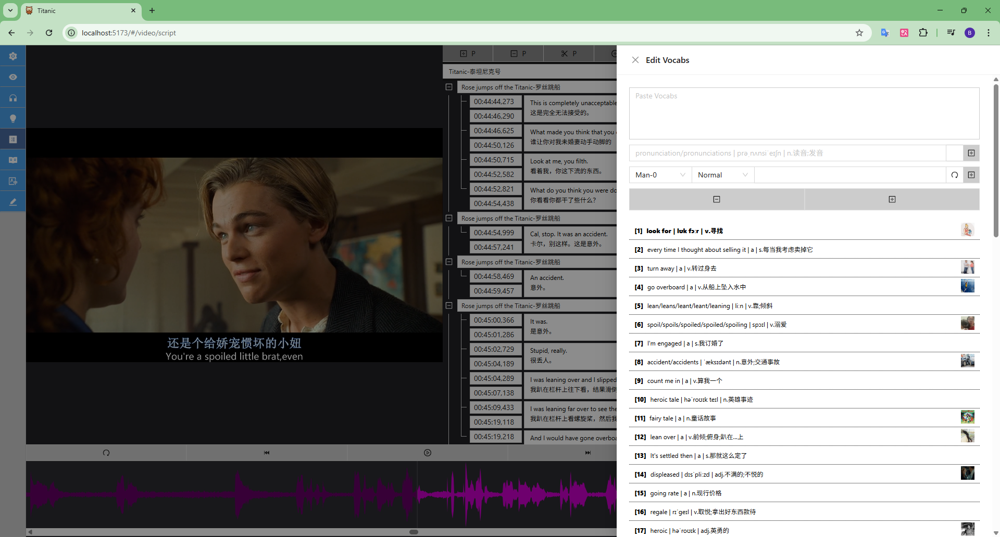
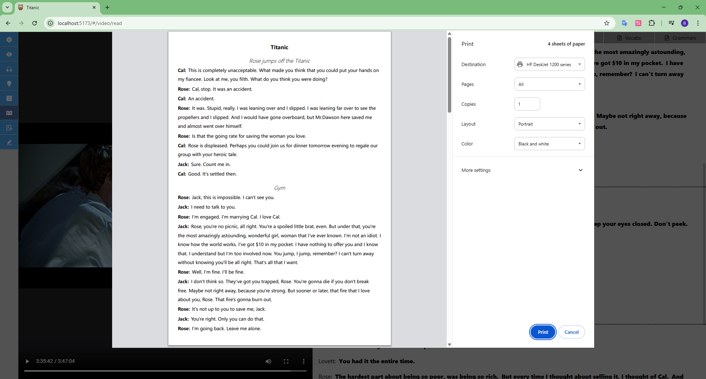
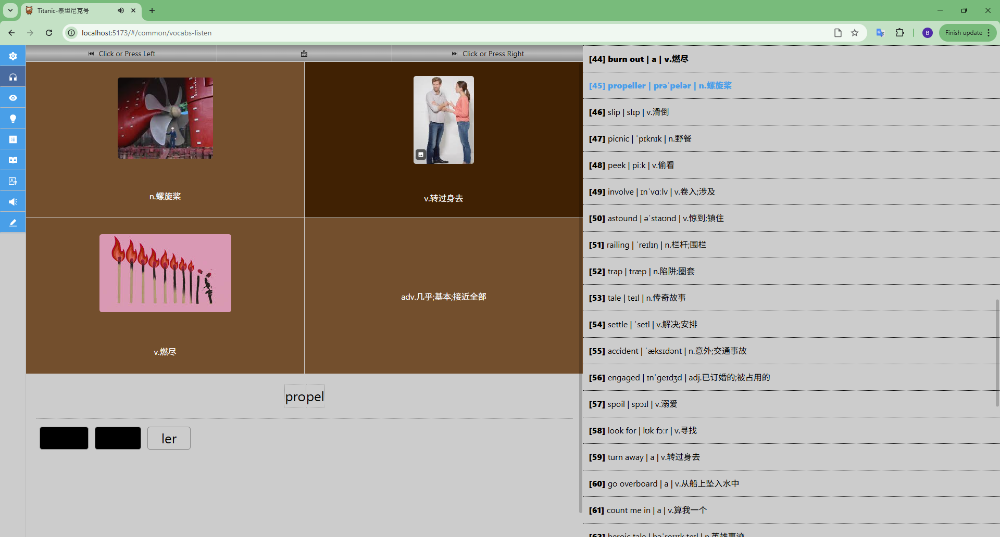
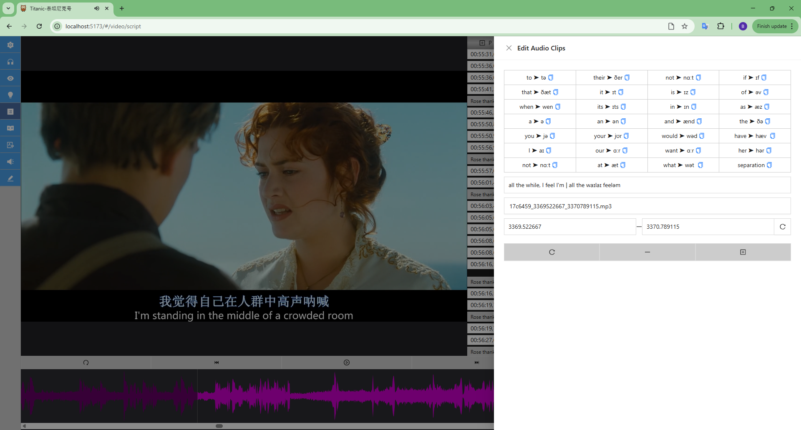
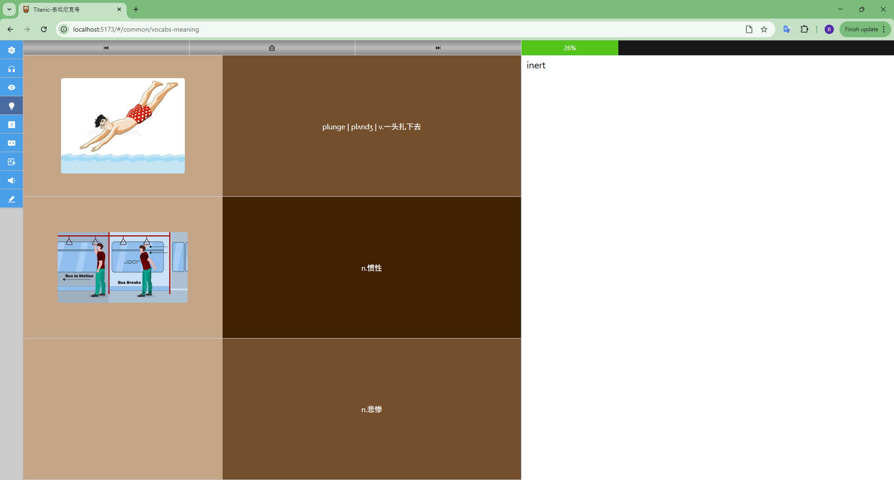

# What is this?

A tool for study languages through videos.

# How to start?

1. Install or Download the dependencies below 
   [FFMPEG for windows](https://www.ffmpeg.org/download.html) 
   python 
   [python's pyttsx3](https://github.com/nateshmbhat/pyttsx3) 
   [BBC audiowaveform](https://github.com/bbc/audiowaveform/releases/tag/1.10.2) 
   Node.js 20.16.0  
2. Config 
   Replace AUDIOWAVEFORM_PATH, FFMPEG_PATH, APP_LOG_PATH, UPLOAD_PATH in "/webapi/.env" to your own paths  
   Replace APP_LOG_PATH in "/webserver/.env" to your own path 
3. Start  
    1. cd / 
    2. npm install 
    3. npm run build 
    4. npm run start 

# Screenshots

